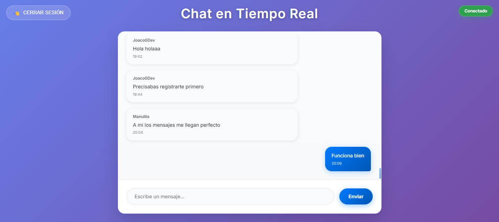
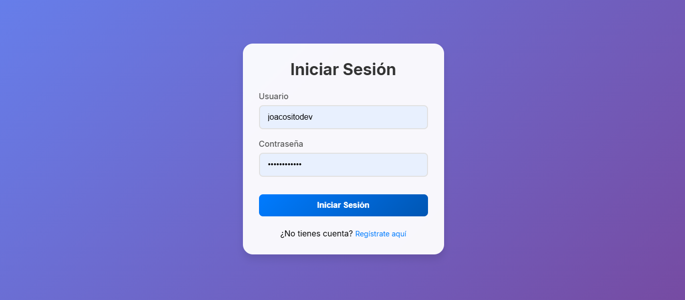
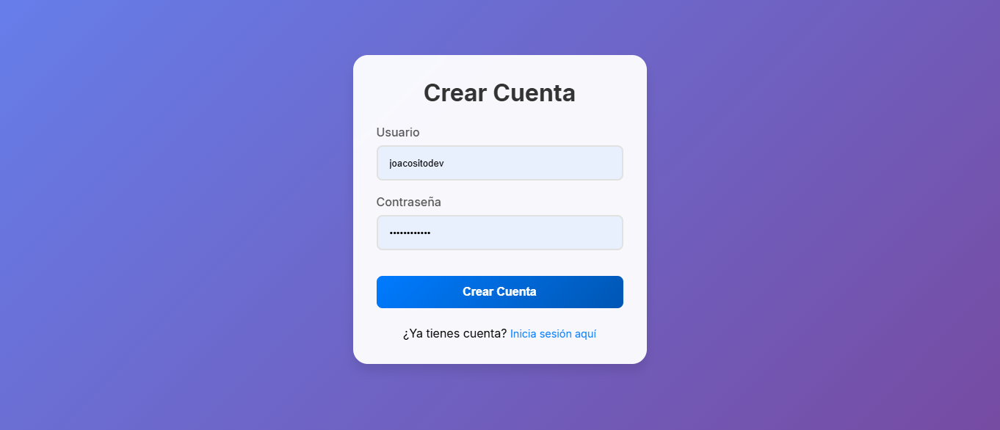

# Realtime Chat

Aplicación de chat en tiempo real construida con Node.js, Express y Socket.io. Permite que los usuarios se registren, inicien sesión y conversen en un entorno con autenticación JWT y persistencia en base de datos SQL (libSQL/Turso compatible con SQLite).

## Capturas de pantalla

### Chat en tiempo real


### Inicio de sesión


### Registro de usuario


## Tecnologías


<p align="left">
  
  
  
  
  
  
  
</p>

## Características

- Chat en tiempo real con Socket.io.
- Registro e inicio de sesión con validaciones.
- Autenticación mediante JWT.
- Persistencia de usuarios y mensajes en base de datos SQL (libSQL/Turso/SQLite).
- Rate limiting en endpoints de autenticación.
- Sanitización de mensajes para mitigar XSS.
- Recuperación de mensajes al reconectar (offset incremental).
- Configuración por variables de entorno.

## Estructura del proyecto

```text
realtime-chat/
├── env.example
├── package.json
├── client/
│   ├── chat.html
│   ├── login.html
│   ├── register.html
│   ├── css/
│   └── js/
└── server/
    ├── server.js
    ├── sockets.js
    ├── db.js
    ├── initDb.js
    ├── routes/
    ├── middleware/
    ├── validators/
    └── config/
docs/
└── images/
    ├── chat.png
    ├── login.png
    └── register.png
```

## Requisitos

- Node.js (recomendado LTS).
- npm (incluido con Node).
- Una base de datos compatible con libSQL (por ejemplo, Turso) o SQLite, según tu configuración en `env.example`.

## Instalación y ejecución (local)

### 1) Descargar el proyecto

Clonar el repositorio y entrar a la carpeta:

```bash
git clone https://github.com/JoacoGDev/realtime-chat.git
cd realtime-chat
```

### 2) Instalar dependencias

```bash
npm install
```

### 3) Configurar variables de entorno

Copiar el archivo de ejemplo y completar los valores según tu entorno:

```bash
cp env.example .env
```

Abrir `.env` y configurar los parámetros requeridos (por ejemplo, secreto JWT y conexión a la base de datos). El archivo `env.example` define qué variables necesita el proyecto.

### 4) Inicializar la base de datos (si aplica)

El proyecto incluye un script de inicialización en `server/initDb.js`. Si es tu primera vez corriendo el proyecto o estás usando una base nueva, ejecutarlo una vez:

```bash
node server/initDb.js
```

Si tu entorno ya tiene las tablas creadas, este paso puede no ser necesario.

### 5) Levantar el servidor

Modo desarrollo (recarga automática):

```bash
npm run dev
```

Modo producción:

```bash
npm start
```

Por defecto el servidor queda disponible en:

```text
http://localhost:3000
```

## Cómo probarlo

1. Con el servidor corriendo, abrir en el navegador:
   - `http://localhost:3000/register.html` para crear una cuenta.
   - `http://localhost:3000/login.html` para iniciar sesión.
   - `http://localhost:3000/chat.html` para entrar al chat (requiere autenticación).

2. Abrir dos ventanas (o un navegador en modo incógnito) con usuarios distintos para validar el chat en tiempo real.

3. Recargar la página para verificar la recuperación de mensajes.

## Seguridad (resumen)

- Contraseñas almacenadas con hash (bcrypt).
- Tokens JWT para autenticación y autorización.
- Rate limiting para reducir abuso en endpoints sensibles.
- Sanitización de contenido para mitigar XSS.
- Variables sensibles por `.env` (no versionar credenciales).

## Scripts útiles

Los scripts disponibles se definen en `package.json`. Habitualmente:

- `npm run dev`: ejecuta en desarrollo.
- `npm start`: ejecuta en producción.

## Notas de implementación (Socket.io)

- El cliente se conecta enviando token JWT y username.
- El servidor valida el token al conectar.
- Los mensajes se envían y reciben en tiempo real.
- Se persisten con un offset incremental para recuperar mensajes tras reconexión.

## Publicación en GitHub

Para que las imágenes se vean en GitHub, deben estar dentro del repositorio. Este README asume esta ruta:

- `docs/images/chat.png`
- `docs/images/login.png`
- `docs/images/register.png`

Asegurate de commitear también esa carpeta.

## Contacto

Autor: JoacoGDev  
Repositorio: https://github.com/JoacoGDev/realtime-chat
